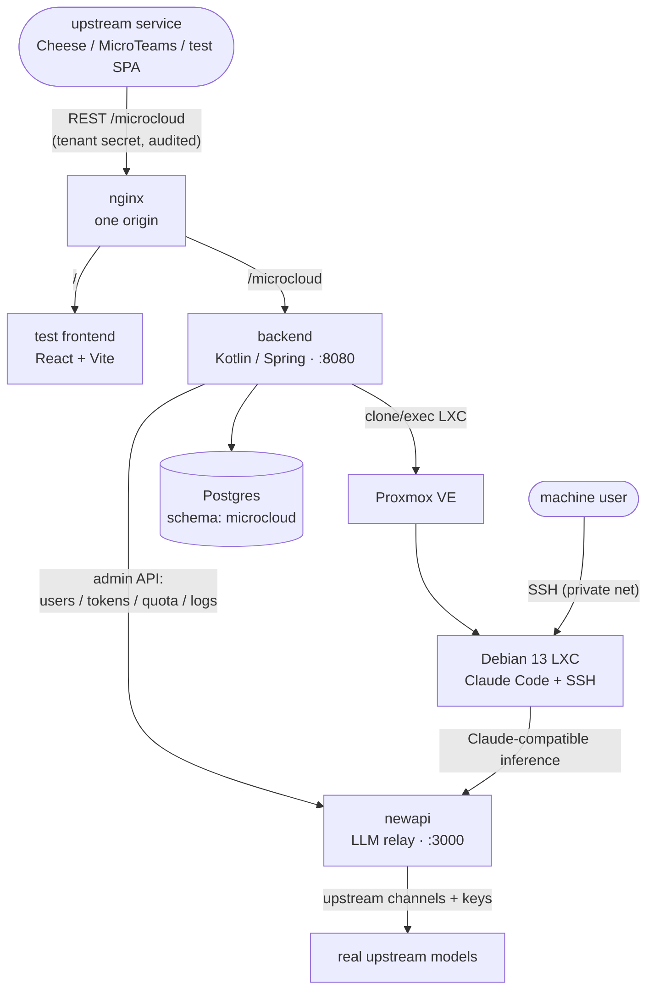
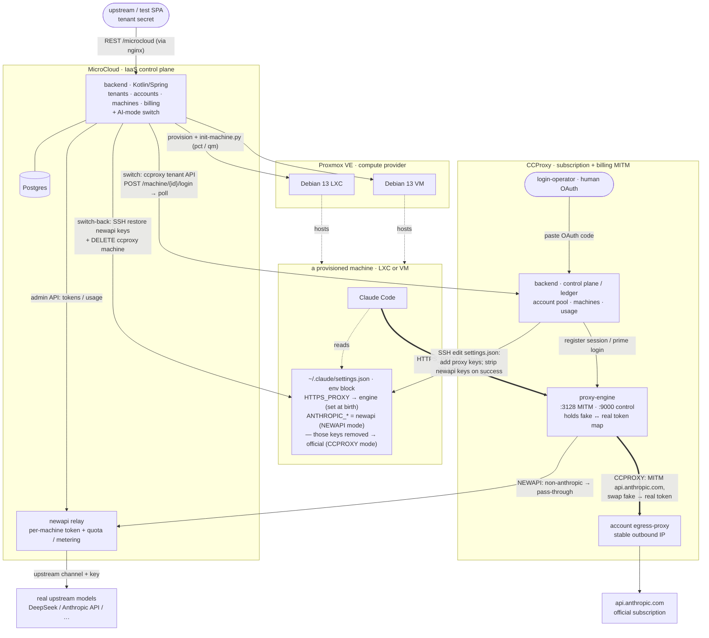

# MicroCloud

A base service that, given **Proxmox** and **newapi**, provisions machines with a working
**Claude Code**, makes them reachable over SSH on a private network, and bills each user for both
**machine compute** and **AI usage**. It is consumed by upstream services (Cheese, MicroTeams, …);
each has its own users, and MicroCloud owns the mapping from `(tenant, external user)` to accounts
and quota.

> **What it is:** a platform-layer **base service / IaaS control plane** — not traditional
> middleware. Upstream services call its REST API to provision and bill machines; it abstracts the
> physical compute provider (today Proxmox) behind a small logical surface (offerings / machines),
> sitting between callers and compute providers as a provider-abstraction layer. It is a
> self-contained, stateful, async control plane — not a library or broker on the request hot path —
> which is also what lets it back other providers later (Proxmox VMs, external clouds, a lighter
> plain-Docker host with no PVE). The design lives in the team doc tree under `tech/microcloud/` and
> `design/microcloud/`.

## Integrators & contributors — read these first

Before writing any code against MicroCloud (integrating an upstream service) or extending it, you
**must** read, in order:

1. **[`business-model.md`](business-model.md)** (English) / **[`业务模型.md`](业务模型.md)** (中文) —
   the business model, every concept, and *why* the API is shaped this way, with a worked example and
   diagrams tracing the chain from Proxmox `cluster/node/pool` up to the tenant-facing **offering**
   and back down to a concrete landing spot. The two files are the same content in two languages.
2. **[`MicroCloud-API.yml`](MicroCloud-API.yml)** — the OpenAPI contract, the single source of truth.
   Its per-operation comments document each endpoint's usage and special cases (e.g. enumeration
   endpoints that require a mandatory tenant-scope condition).

These explain the deliberate split between the **physical** layer (Proxmox clusters, placements,
networks — operator-only) and the **logical** layer callers see (offerings, machines). That split
exists to keep the door open for future compute providers (Proxmox VMs, external clouds, or a lighter
plain-Docker host with no PVE) and to give callers a small, clear surface. Skipping these docs leads
to designs that leak Proxmox details or misuse the tenant abstractions.

## Architecture



- **nginx** — the one public origin; serves the SPA at `/` and proxies the backend at `/microcloud`.
- **backend ("microcloud")** — Kotlin / Spring Boot. Tenants, customers, accounts, machines (incl.
  their AI mode), offerings/placements, audit. Interfaces are **generated** from `MicroCloud-API.yml`.
- **newapi** — our fork [`micro-teams/new-api`](https://github.com/micro-teams/new-api) (release
  `v1.0.0-rc.21`): the LLM relay + per-key quota/metering. MicroCloud orchestrates its admin API. It
  is the **default** of two AI modes: a machine can also be switched to a real Anthropic subscription
  behind [ccproxy](https://github.com/micro-teams/ccproxy) (`POST /machine/{id}/ai/ccproxy`, back with
  `/ai/newapi`) — see `deploy/README.md`.
- **Proxmox VE** — provisions the Debian 13 machine, as an LXC container (`templates/lxc/debian13/`)
  or a full VM (`templates/vm/debian13/`) depending on the template's kind. Machines ship Docker plus
  `git` / `tmux` / `jujutsu (jj)`, and are powered off with a graceful `shutdown` (a hard `stop`
  stays as a force fallback).
- **Postgres** — MicroCloud's own schema `microcloud`.

### The whole picture — compute + AI modes + ccproxy

One diagram tying it together: MicroCloud provisions a machine on Proxmox (LXC or VM); the machine's
Claude Code takes its model access one of two ways, switchable per machine; and the ccproxy path
shows the MITM token-swap that lets many machines share one Anthropic subscription without ever
holding the real credential.



Reading it:

- **Two AI modes, one machine** (the thick arrows are the machine's Claude traffic). The proxy points
  at the ccproxy engine from birth, so switching only changes what is in `settings.json`, never the
  network path. **NEWAPI** (default): `ANTHROPIC_BASE_URL/AUTH_TOKEN` point at newapi; the engine sees
  a non-Anthropic host and passes it straight through to newapi → real upstream models. **CCPROXY**
  (switched): those keys are gone, so Claude hits `api.anthropic.com`; the engine MITMs it and swaps
  the machine's **fake** token for the account's **real** subscription token — the real credential
  never touches the machine.
- **The switch** is MicroCloud calling ccproxy's tenant API and editing the shared `settings.json`
  over SSH (each side owns its own keys); the one-time OAuth is completed by a human login-operator.
- **If ccproxy is not wired**, the engine simply isn't there: machines run NEWAPI with Claude talking
  to newapi directly, and the `/ai/ccproxy` switch is unavailable.

## What is here

| | |
|---|---|
| **`MicroCloud-API.yml`** | The single API contract. Backend interfaces and the frontend client are both generated from it. |
| **`backend/`** | Kotlin / Spring Boot. The borrowed authorization framework keeps its `org.rucca.cheese.auth` package; everything else is `app.microteams.microcloud`. |
| **`frontend/`** | Minimal React + Vite test SPA — calls only the public API that upstreams also use (no extra backend). |
| **`templates/lxc/debian13/`** | The LXC machine template, as stdlib-Python routines the service calls: `build.py` (packages the template tarball) + `init-machine.py` (initializes a provisioned machine) + `files/`. |
| **`templates/vm/debian13/`** | The VM machine template: an `image-url` (base cloud image) + `build.sh` (baked into a Proxmox VM template: Docker + docker group) + `init-machine.py` (per-machine setup, piped over SSH after cloud-init). |
| **`deploy/`** | docker-compose (nginx + backend + newapi + postgres), bind-mounted stock images. |

## Build & run

```sh
cd backend && ./scripts/dependency-start.sh   # a local Postgres with the "microcloud" schema
./mvnw install                                # builds + runs integration tests
java -jar target/backend-*.jar
```

The whole cluster (with newapi): `cd deploy && bash gen-env.sh && docker compose up -d`.

## One contract, generated both ways

`MicroCloud-API.yml` is the source of truth: the backend regenerates `app.microteams.microcloud.api.*Api`
on every build (each path's first segment names its `Api` and its controller), and the frontend
regenerates its client. Change the API by editing the yaml first.
