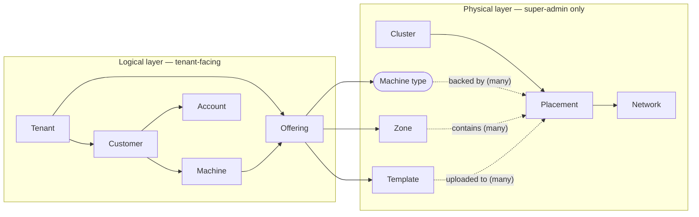
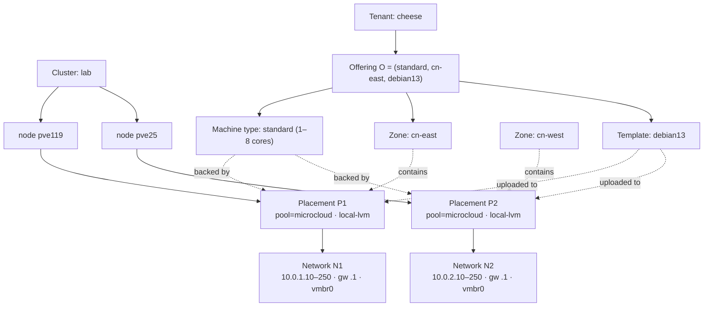
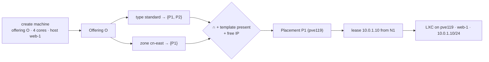

# MicroCloud — Business Model & Concepts

> **Read this before integrating.** MicroCloud is consumed by upstream services (Cheese,
> MicroTeams, …). This document explains what the concepts mean and *why* the API is shaped the way
> it is. The machine-readable contract is [`MicroCloud-API.yml`](MicroCloud-API.yml); the Chinese
> version of this document is [`业务模型.md`](业务模型.md).

## What MicroCloud is

MicroCloud turns compute infrastructure (today: Proxmox VE) into a simple self-service API: an
upstream service's users get real machines (today: Debian 13 LXC containers with Docker, reachable
over SSH on a private network), billed against prepaid fund accounts. It is multi-tenant: each
upstream service is a **tenant**, and each tenant has its own end-users.

In one line: MicroCloud is a **base service / IaaS control plane**, not traditional middleware — a
self-contained, stateful, async service that upstreams call over REST to provision and bill machines,
abstracting the physical compute provider behind a small logical surface (the provider-abstraction
layer described below).

## The core idea: physical reality vs. logical abstractions

MicroCloud deliberately splits its model into two layers.

- **Physical layer (super-admin only):** the real infrastructure — Proxmox clusters, the nodes /
  pools / storages inside them, IP ranges, template images. Operators configure this; callers never
  see it.
- **Logical layer (tenant-facing):** a tiny, provider-agnostic surface — *offerings* (a machine
  type + zone + template a tenant may use), and the *machines* created from them. A tenant never
  learns that a machine is a Proxmox LXC on node `pve119` drawing an IP from range `10.0.0.0/24`.

This separation exists for two reasons:

1. **Flexibility for future compute providers.** Because callers only touch the logical layer,
   MicroCloud can later back a "machine type" with something other than a Proxmox LXC — a Proxmox
   **VM**, an **external cloud** instance, or a lighter **plain-Docker** host that doesn't need PVE
   at all — without any change to the caller's code. The physical layer is an implementation detail
   behind the abstraction.
2. **A simple, clear, easy-to-use interface for callers.** A tenant reasons about "a *standard-4c*
   machine in the *cn-east* zone from the *debian13* template", not about clusters, nodes, pools,
   storages, bridges, and volume IDs. The complexity of the physical world stays on the operator's
   side.

## How the concepts relate (one-to-many)

A box pointing at several boxes is a one-to-many relationship: a **cluster** has many **placements**;
a **machine type** is backed by many placements; a **zone** contains many placements; a **template**
is uploaded to many placements; a **tenant** has many **offerings** and many **customers**; a
**customer** has many **accounts** and **machines**. An **offering** references exactly one machine
type + one zone + one template.

## Concepts

### Physical layer (managed by the super-admin)

- **Proxmox cluster** — a provider credential: an API URL + API token. The token secret is
  write-only (never returned). One MicroCloud can drive several clusters.
- **Placement** — a concrete landing coordinate on a cluster: `cluster + node + pool + storage`. A
  machine is ultimately created into some placement. *Example:* `pve119 / pool=microcloud /
  storage=local-lvm`.
- **Network** — an IPv4 range bound to a placement (`start–end`, gateway, prefix, bridge). Machines
  in that placement lease a private IP from it. Purely internal — tenants have **no** network
  concept; MicroCloud picks the address automatically.
- **Machine type** — a performance class with *allowed spec ranges* (cores / memory / disk min..max),
  backed by one or more placements. *Example:* `standard` = 1–8 cores, 1–8 GiB RAM, 10–100 GB disk,
  backed by placements on `pve119` and `pve25`.
- **Zone** — a locality partition over placements (machines in the same zone communicate faster). A
  zone is a set of placements. *Example:* `cn-east` = the placements physically in one datacenter.
- **Template** — a catalog machine image (e.g. `debian13`, our Debian 13 + Docker + Claude Code
  image). Templates are uploaded per-placement (the image is copied onto that placement's storage);
  a machine can only be created on a placement where its template is present.

### The bridge: offerings

- **Offering** — a `(machine type, zone, template)` triple that a super-admin grants to a specific
  tenant. **This is the tenant's entire catalog.** Instead of browsing machine types, zones, and
  templates through separate endpoints, a tenant lists its offerings — each already carries the
  machine type's spec ranges plus the zone and template names, so one call gives everything needed
  to create a machine. A tenant can only provision from an offering it was granted.

  *Example:* super-admin grants tenant *cheese* the offering `(standard, cn-east, debian13)`. Tenant
  *cheese* then sees one row telling it: type `standard` (1–8 cores, …), zone `cn-east`, template
  `debian13`. It provisions with that offering's id.

### Logical layer (used by the tenant)

- **Tenant** — one upstream deployment (e.g. a Cheese instance). It authenticates with an opaque
  **auth secret** (a Bearer token; a tenant may hold several). Every tenant call is scoped and
  audited.
- **Customer** — one of the tenant's end-users, keyed by an `externalRef` (the tenant's own user id).
  A customer owns accounts and machines.
- **Account** — a prepaid fund account under a customer. It is a generic ledger: a pure numeric
  balance plus an immutable record of every change (top-up / charge / …). Compute (and, later, AI
  usage) is billed against it. *Example:* a customer has a `compute` account topped up to 100.
- **Machine** — a provisioned instance owned by a customer, created from an **offering** + a chosen
  **hostname**, spec (within the offering type's ranges), login user + SSH key, and the fund account
  to charge. Its lifecycle (create / start / stop / delete) is **asynchronous**: the API returns
  immediately with a transitional status and the caller polls until a terminal one. MicroCloud
  auto-selects the placement (backing the type, in the zone, with the template present and a free
  IP) and leases the private IP — none of which the tenant sees.
- **API key** *(planned, not yet implemented)* — a model-relay key (a newapi token bound to an
  account) that a machine's Claude Code uses, so AI usage bills to that account, separately from the
  machine's compute account.

## Worked example: from cluster to offering, and back to a landing spot

The chain from Proxmox internals up to an offering — and how a machine create resolves back down to
one concrete placement + IP — is the subtle part. Here it is end to end with concrete values.

**Physical layer the operator builds, and how the offering sits on top:**

Note the relationships: a **machine type** declares *which placements can back it* (P1 **and** P2); a
**zone** declares *which placements are in that locality* (`cn-east` = P1 only); a **template** exists
*on specific placements* (it had to be uploaded there); a **network** provides *the IPs of one
placement*. The **offering** ties one type + one zone + one template together and is granted to
tenant *cheese*, who sees exactly one catalog row for O — type `standard` (1–8 cores, …), zone
`cn-east`, template `debian13` — and never P1/P2/N1/pve119.

**Creating a machine from O (4 cores, hostname `web-1`) resolves back down like this:**

1. Candidate placements = type's placements ∩ zone's placements = `{P1, P2} ∩ {P1}` = **`{P1}`**.
2. Keep only placements that are active, have the template `debian13` present, and have a network
   with a free IP → P1 qualifies (debian13 is uploaded, N1 has free IPs).
3. Lease the next free IP from N1 → **`10.0.1.10`**.
4. Create the LXC on **pve119**, pool `microcloud`, storage `local-lvm`, `net0 = 10.0.1.10/24 gw
   10.0.1.1 bridge vmbr0`, from `debian13`.

So the zone narrowed the type's placements to a locality; the template + free-IP requirement picked
the final placement; the network supplied the address. The tenant expressed intent as "offering O +
hostname + spec"; MicroCloud did all of the resolution. Had the offering used zone `cn-west`, the
same machine would have landed on P2/pve25 with a `10.0.2.x` address — no caller change.

## A typical flow

1. **Operator (super-admin):** add a Proxmox cluster → define a placement, a network on it, a
   machine type and a zone over that placement → upload the `debian13` template to the placement →
   create a tenant and mint it a secret → grant the tenant an offering `(type, zone, template)`.
2. **Tenant:** create a customer → create + top-up a fund account → list offerings → create a
   machine (pick the offering, a hostname, a spec within range, a login user + SSH key, the account)
   → poll the machine until `running` → SSH in as the login user.

## Notes on the API surface

- **Two auth realms.** `superAdmin` (a session token from password login) manages the physical layer
  + tenants + offerings. `tenantSecret` (an opaque per-tenant secret) manages that tenant's own
  customers / accounts / machines and reads its offerings. A few reads (e.g. `GET /machine/offering`)
  are dual-realm and behave differently per realm (see the contract).
- **Enumeration endpoints carry a mandatory scoping condition.** List endpoints are designed as
  composable optional filters, but the *tenant-scope* condition is always enforced — a tenant can
  only ever enumerate its own resources, and a cross-tenant filter (e.g. listing accounts by a
  customer that isn't yours) is rejected. This is called out per-endpoint in the contract.
- **Everything Proxmox is async.** Machine create/start/stop/delete and template upload map to
  Proxmox tasks; the API accepts them (HTTP `202` / a transitional status) and the caller polls.
