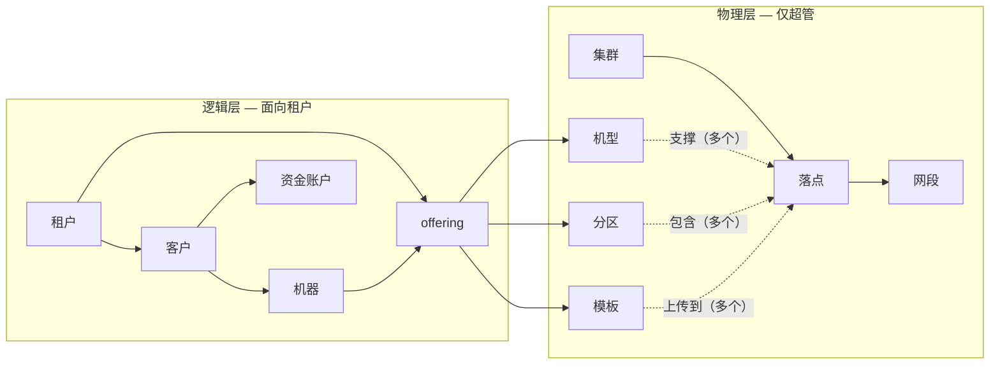
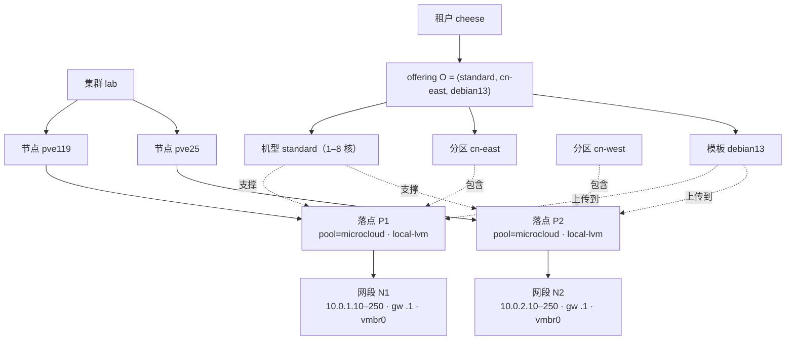
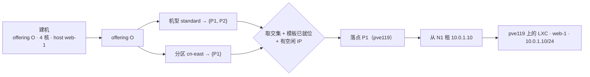

# MicroCloud —— 业务模型与概念

> **接入前必读。** MicroCloud 由上游服务（Cheese、MicroTeams…）调用。本文解释各概念的含义，以及
> 接口为何这样设计。机器可读的契约是 [`MicroCloud-API.yml`](MicroCloud-API.yml)；英文版是
> [`business-model.md`](business-model.md)。

## MicroCloud 是什么

MicroCloud 把算力基础设施（当前：Proxmox VE）封装成一套简单的自助 API：上游服务的用户能拿到真实
机器（带 Docker/git/tmux/jujutsu 的 Debian 13、经私网 SSH 可达——按模板可为轻量 **LXC 容器**或完整
**VM**），每台跑的 Claude Code 默认经 **newapi** 中继取模型、可按机器切到官方 **订阅**（经 ccproxy）；
机器带预付费资金账户，为算力与 AI 用量计费。它是多租户的：每个上游服务是一个**租户（tenant）**，每个
租户有各自的终端用户。

一句话：MicroCloud 是**平台层的基础服务 / IaaS 控制平面**，而非传统中间件——一个自成一体、有状态、
生命周期异步的服务，上游通过 REST 调它来开机器、计费，把物理算力提供方抽象成简单的逻辑面（即下文的
provider 抽象层）呈现给调用方。

## 核心思想：物理现实 vs. 逻辑抽象

MicroCloud 刻意把模型分成两层。

- **物理层（仅超级管理员可见）**：真实基础设施——Proxmox 集群，及其内部的节点/资源池/存储、IP 段、
  模板镜像。由运维配置，调用方永远看不到。
- **逻辑层（面向租户）**：一个极小、与算力提供方无关的接口——**offering（可用三元组）**（租户可用的
  「机型 + 分区 + 模板」），以及由它创建出的**机器（machine）**。租户永远不会得知某台机器其实是
  `pve119` 节点上、从 `10.0.0.0/24` 段取 IP 的一个 Proxmox LXC。

这种隔离出于两个目的：

1. **为算力提供方保留灵活性。** 因为调用方只接触逻辑层，MicroCloud 可以用不同的底层承载同一个「机型」而
   调用方代码不变。接缝就是**落点的 kind**——它坐标的首位 `提供者/形态`（`proxmox/lxc`、`proxmox/vm`……）。
   这一点**已经落地**：Proxmox LXC 和 Proxmox VM 只是两种落点 kind，租户对此无感。同一道接缝也为以后接
   **外部云**实例、或更轻的不依赖 PVE 的 **纯 Docker** 主机留了余地——每一种都是一个新 kind + 一个 provisioner
   分支。物理层只是抽象背后的实现细节。
2. **给调用方一个简单、清晰、易用的接口。** 租户想的是「在 *cn-east* 分区、用 *debian13* 模板、开一台
   *standard-4c* 机器」，而不是集群、节点、池、存储、网桥、卷 ID。物理世界的复杂性都留在运维一侧。

## 概念之间的关系（一对多）

一个框指向多个框即一对多：一个**集群**有多个**落点**；一个**机型**由多个落点支撑；一个**分区**包含多个
落点；一个**模板**上传到多个落点；一个**租户**有多个 **offering** 和多个**客户**；一个**客户**有多个
**资金账户**和**机器**。一条 **offering** 恰好引用一个机型 + 一个分区 + 一个模板。

## 概念

### 物理层（超级管理员管理）

- **Proxmox 集群（cluster）**——一份提供方凭证：API URL + API token。token secret 只写不回传。一套
  MicroCloud 可驱动多个集群。
- **落点（placement）**——一个具体的落点坐标，**首位是 kind**——它承载的提供者 + 机器形态（`proxmox/lxc`、
  `proxmox/vm`，将来如 `somecloud/…`）——其后才是提供者相关的位置（Proxmox 下是 `集群 + 节点 + 资源池 + 存储`）。
  机器被创建到某个 placement 上，其 kind 是「如何供给这台机器」的权威来源（provisioner 按它分派）。这就是接
  新算力提供者的接缝：新提供者/形态 = 一种新的落点 kind + 一个 provisioner 分支，落点之上的一切都与 kind 无关。
  *例：*`proxmox/lxc @ pve119 / pool=microcloud / storage=local-lvm`。
- **网段（network）**——绑定到某 placement 的一段 IPv4（`start–end`、网关、前缀、网桥）。该 placement 上
  的机器从中租用私网 IP。纯内部概念——租户**没有**网段的概念，地址由 MicroCloud 自动选取。
- **机型（machine type）**——一个性能等级，带**允许的规格区间**（cores / memory / disk 各自 min..max），
  由一个或多个 placement 支撑。*例：*`standard` = 1–8 核、1–8 GiB 内存、10–100 GB 磁盘，由 `pve119`、
  `pve25` 上的 placement 支撑。
- **分区（zone）**——placement 的局部性划分（同分区内机器通信更快）。一个 zone 是一组 placement。
  *例：*`cn-east` = 物理上位于同一机房的那些 placement。
- **模板（template）**——目录里的机器镜像（如 `debian13`，即我们的 Debian 13 + Docker 镜像），带一个
  **kind**（`proxmox/lxc`、`proxmox/vm`）——即镜像的形态——它必须与所用落点的 kind 一致。模板按 placement
  「上传」使其可用；机器只能创建在**同 kind**、且其模板已就位的 placement 上。「上传」的含义随 kind 而异：
  **LXC** 模板把 rootfs tarball 拷到该 placement 的存储；**VM** 模板则在该 placement 上**烤制**——MicroCloud
  把基础云镜像开机一次、装好 Docker，存成一台 Proxmox VM 模板，之后的机器从它 clone。模板之上的一切（机型、
  分区、offering、建机流程）都与 kind 无关。

### 桥梁：offering（可用三元组）

- **Offering**——超级管理员配给某个具体租户的一条 `(机型, 分区, 模板)` 三元组。**它就是租户的全部目录。**
  租户不再通过多个接口分别浏览机型、分区、模板，而是直接列出自己的 offering——每条已内嵌该机型的规格
  区间以及分区名、模板名，因此一次调用就拿到建机所需的一切。租户只能从它被授予的 offering 建机。

  *例：*超管把 offering `(standard, cn-east, debian13)` 授给租户 *cheese*。租户 *cheese* 便看到一行，
  告诉它：机型 `standard`（1–8 核…）、分区 `cn-east`、模板 `debian13`；用这条 offering 的 id 建机。

### 逻辑层（租户使用）

- **租户（tenant）**——一个上游部署（如某个 Cheese 实例）。用一个不透明的**认证密钥（auth secret）**
  （Bearer token；一个租户可持有多把）认证。租户的每次调用都被限定范围并审计。
- **客户（customer）**——租户的一个终端用户，以 `externalRef`（租户自己的用户 id）标识。一个 customer
  拥有账户和机器。
- **资金账户（account）**——某 customer 名下的预付费账户。它是一个通用记账本：一个纯数字余额，加上每一笔
  变动的不可变流水。*例：*某客户有一个充值到 100 的 `compute` 账户。算力与 AI 用量各**指定**一个账户扣费
  （见 machine）；账户/账本模型与 **topup** 已实现，但按机时/AI 用量自动扣费的**计量循环是设计、尚未实现**。
- **机器（machine）**——某 customer 拥有的一台已供给实例，由一条 **offering** + 指定的 **hostname**、规格
  （在 offering 机型区间内）、登录用户 + SSH 公钥、以及**最多三个要扣费的资金账户**创建：算力（`accountId`）
  + newapi/ccproxy AI 用量（`newapiAccountId`/`ccproxyAccountId`，留空各回落 compute）。其生命周期
  （建/起/**优雅 shutdown 或强制 stop**/删）是**异步**的：API 立即返回过渡态，调用方轮询到终态。MicroCloud
  自动选落点（支撑该机型、在该分区、模板已就位、且有空闲 IP）并租用私网 IP——这些租户都看不到。
- **AI 模式（aiMode）**——机器上 Claude Code 怎么取模型（`Machine.aiMode`，配 `aiStatus`）：默认走
  **newapi** 中继（每机自动签发一枚令牌），或经 [ccproxy](https://github.com/micro-teams/ccproxy) 走官方
  **订阅**，可按机器切换（`POST /machine/{id}/ai/ccproxy`，切回 `/ai/newapi`）。每条流各扣自己的账户。
  **没有独立的 API key 资源**——早期「先建 key」设计已被 aiMode 取代，`apiKeyId` 仅作遗留字段保留。

## 贯穿示例：从 cluster 到 offering，再解析回落点

从 Proxmox 内部一路到 offering、以及建机时又如何解析回某一个具体落点 + IP——这条链最绕。下面用具体值
端到端走一遍。

**运维搭建的物理层，以及 offering 如何架在其上：**

关系要点：**机型**声明*哪些落点能支撑它*（P1 **和** P2）；**分区**声明*哪些落点属于该局部性*（`cn-east`
只有 P1）；**模板**存在*于特定落点上*（必须先上传到那里）；**网段**提供*某一个落点的 IP*。**offering** 把
一个机型 + 一个分区 + 一个模板绑到一起，授给租户 *cheese*；cheese 只看到 O 这一行——机型 `standard`
（1–8 核…）、分区 `cn-east`、模板 `debian13`——永远看不到 P1/P2/N1/pve119。

**从 O 建一台机器（4 核、hostname `web-1`）如何解析回落点：**

1. 候选落点 = 机型的落点 ∩ 分区的落点 = `{P1, P2} ∩ {P1}` = **`{P1}`**。
2. 只保留「active、模板 `debian13` 已就位、且有空闲 IP 的网段」的落点 → P1 合格（debian13 已上传，N1 有
   空闲 IP）。
3. 从 N1 租下一个空闲 IP → **`10.0.1.10`**。
4. 在 **pve119**、pool `microcloud`、存储 `local-lvm`、`net0 = 10.0.1.10/24 gw 10.0.1.1 网桥 vmbr0`、
   用 `debian13` 创建这台 LXC。

于是：分区把机型的落点收窄到某局部性；「模板已就位 + 有空闲 IP」定下最终落点；网段给出地址。租户只表达了
「offering O + hostname + 规格」，其余全由 MicroCloud 解析。若 offering 用的是分区 `cn-west`，同样的建机
就会落到 P2/pve25、拿一个 `10.0.2.x` 地址——调用方无需任何改动。

## 一个典型流程

1. **运维（超管）：** 加一个 Proxmox 集群 → 定义一个 placement、其上一段 network、一个机型和一个覆盖该
   placement 的分区 → 把 `debian13` 模板上传到该 placement → 建一个租户并给它签发 secret → 给该租户授予一条
   offering `(机型, 分区, 模板)`。
2. **租户：** 建一个 customer → 建资金账户并充值 → 列出 offering → 建机（选 offering、填 hostname、给区间内
   规格、登录用户 + SSH 公钥、扣费账户）→ 轮询机器到 `running` → 以登录用户 SSH 进去。

## 关于接口的几点说明

- **两个鉴权域。** `superAdmin`（密码登录得到的会话 token）管物理层 + 租户 + offering。`tenantSecret`
  （不透明的租户密钥）管该租户自己的 customer / account / machine，并读自己的 offering。少数读接口
  （如 `GET /machine/offering`）是双域的、按域行为不同（详见契约）。
- **枚举接口带有强制的范围条件。** 列举接口设计成「多个可选过滤条件的拼接」，但**租户范围**这条始终强制——
  租户只能枚举自己的资源，跨租户过滤（如按不属于你的 customer 列账户）会被拒。契约中对每个接口都专门标注。
- **一切与 Proxmox 相关的操作都是异步的。** 建机/起/停/删、模板上传都对应 Proxmox 任务；API 受理后
  （HTTP `202` / 一个过渡态）由调用方轮询。
